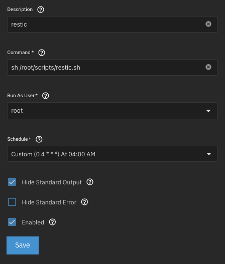

+++
title = 'Backups with restic from TrueNAS Scale to Hetzner Storage Box'
date = 2025-03-02T12:19:40+01:00
tags = ["backup","storage"]
draft = false
+++

Until recently, I didn’t have a proper backup strategy for my NAS. I simply replicated the data to an external hard drive, which was also located in my apartment – essentially the only copy of my data.

Now that I’m using my NAS in a production environment and primarily store important data there, I need a reliable method to back up this data securely to the cloud and restore it in case of a failure.

For this, I chose **[restic](https://restic.net)**.

---

## Why restic?

- **Security:** Backups are encrypted by default  
- **Efficiency:** Deduplication saves storage space and bandwidth  
- **Simplicity:** Easy to use via the command line  
- **Automation:** Simple integration into scripts or cron jobs  
- **Flexibility:** Supports multiple transfer protocols (SFTP, REST, Rsync)

## Installing restic on TrueNAS Scale

Since TrueNAS Scale is a closed system, restic cannot be installed via a package manager. Instead, I download the latest version directly from GitHub.

### Installation commands

```bash
cd /root/
wget https://github.com/restic/restic/releases/download/v0.17.3/restic_0.17.3_linux_amd64.bz2
7z x ./restic_0.17.3_linux_amd64.bz2; rm ./restic_0.17.3_linux_amd64.bz2
mv ./restic_0.17.3_linux_amd64 ./restic
chmod +x ./restic
/root/restic self-update
```

Now, restic can be executed with the command `/root/restic`.

## Setting up access to the Hetzner Storage Box

For restic to store backups via SFTP on the Hetzner Storage Box, SSH access must be configured.

1. In **Hetzner Robot**, select the Storage Box and enable SSH support.
2. Generate a key pair using `ssh-keygen`.
3. Transfer the public key to the Storage Box:

```bash
cat ~/.ssh/id_rsa.pub | ssh -p23 u000000@u000000.your-storagebox.de install-ssh-key
```
*(Replace `u000000` with your actual Storage Box username.)*

## Creating a repository

Use the following command to create a new backup repository on the Storage Box:

```bash
/root/restic -r sftp:u000000@u000000.your-storagebox.de:/restic/reponame init
```

You now have an empty backup repository where backups can be stored.

## Automating backups

To run backups regularly, I created a shell script at `/root/scripts/restic.sh`:

```bash
#!/bin/bash

# restic backup
/root/restic -r sftp:u000000@u000000.your-storagebox.de:/restic/share --password-file "/root/scripts/restic-pass" --tag auto backup /mnt/storage/share;

# restic forget (remove old snapshots based on retention policy)
/root/restic -r sftp:u000000@u000000.your-storagebox.de:/restic/share --password-file "/root/scripts/restic-pass" forget --prune --keep-tag keep --keep-daily 7 --keep-weekly 4 --keep-monthly 6 --keep-yearly 5;

# clean up cache
/root/restic cache --cleanup;
```

### Script explanation

1. **Run backup**: The data in `/mnt/storage/share` is backed up to the repository on the Storage Box.
2. **Manage old snapshots**:
   + **Daily snapshots**: Keep 7 days
   + **Weekly snapshots**: Keep 4 weeks
   + **Monthly snapshots**: Keep 6 months
   + **Yearly snapshots**: Keep 5 years
3. **Clean up cache** to free up disk space.

The file `/root/scripts/restic-pass` contains the repository password and is required for the script to run automatically.

### Cron job for automatic backups

To ensure the backup script runs regularly, a cron job is set up.
This is done through the **TrueNAS Web GUI**:

1. Navigate to **System > Advanced Settings > Cron Jobs**
2. Add a new cron job with the following command:
```bash
/bin/bash /root/scripts/restic.sh
```
3. Schedule: **Run daily at 04:00 AM**
4. Enable email notifications to be informed of any errors.

